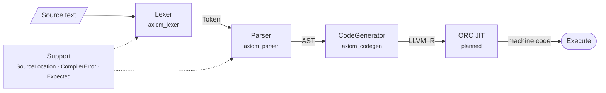
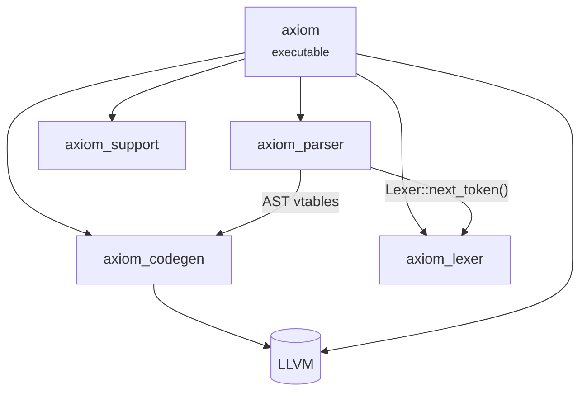
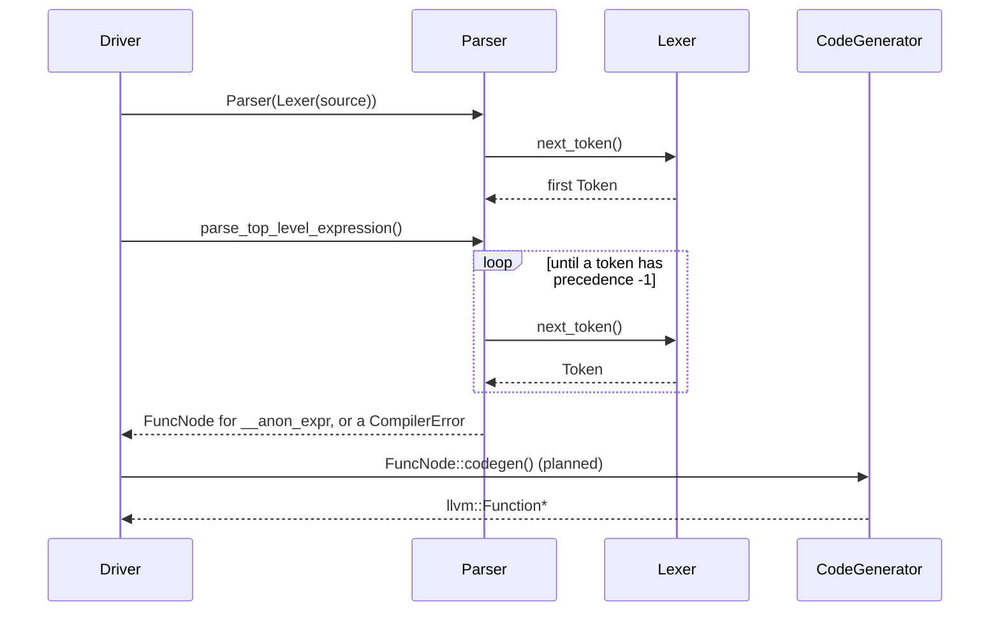

# Axiom — Architecture

Axiom's compiler is a pipeline of four static libraries plus a driver executable. This document describes what each stage does, the contracts between stages and how the build is put together. It also traces one expression from source text to LLVM IR. Stages that don't exist yet are marked *planned*.

For the language itself (syntax, operators and error messages), see the [Language Reference](LANGUAGE.md).

---

## 1. Pipeline Overview

```text
source text ──► Lexer ──► Parser ──► AST ──► CodeGenerator ──► LLVM IR ──► JIT (planned)
```

| Stage | Input → output | Public header | Implementation | CMake target | Status |
|---|---|---|---|---|---|
| Support | — | [`support/error.h`](../include/axiom/support/error.h), [`support/source_location.h`](../include/axiom/support/source_location.h) | [`src/support/`](../src/support/) | `axiom_support` | Done |
| Lexer | Source text → `Token` | [`lexer.h`](../include/axiom/lexer.h), [`token.h`](../include/axiom/token.h) | [`src/lexer/lexer.cpp`](../src/lexer/lexer.cpp) | `axiom_lexer` | Done |
| Parser | `Token` → AST | [`parser.h`](../include/axiom/parser.h), [`ast.h`](../include/axiom/ast.h) | [`src/parser/parser.cpp`](../src/parser/parser.cpp) | `axiom_parser` | Done |
| Code generator | AST → LLVM IR | [`codegen.h`](../include/axiom/codegen.h) | [`src/codegen/codegen.cpp`](../src/codegen/codegen.cpp) | `axiom_codegen` | Expressions done; functions planned |
| JIT and REPL | LLVM IR → machine code → result | — | — | — | Planned |
| Driver | — | — | [`src/main.cpp`](../src/main.cpp) | `axiom` | Smoke test |

All public headers live under `include/axiom/`, and every library exposes that directory, so includes are always written as `#include "axiom/..."`.

---

## 2. Stage by Stage

### 2.1 Support: locations and errors

Every other stage builds on two small types:

- `SourceLocation` holds a 1-based `line` and `column` (`uint32_t`).
- `CompilerError` holds a `message` and the `SourceLocation` it refers to.

Fallible operations return `Expected<T>`, an alias for `std::expected<T, CompilerError>`. The frontend never throws for errors in user input. Errors travel up the call stack as values, and the caller decides what to do with them. `report_error()` prints an error to standard error as `axiom:LINE:COL: error: MESSAGE`.

The parser uses two propagation idioms:

```cpp
auto expr = parse_expression();
if (!expr) return expr;                             // same Expected<T>: pass it through unchanged

auto proto = parse_prototype();
if (!proto) return std::unexpected(proto.error());  // different T: re-wrap the error
```

### 2.2 Lexer

The `Lexer` holds a `std::string_view` of the whole source, a cursor and the current `SourceLocation`. Each call to `next_token()` skips whitespace and `#` comments and then classifies the next token by its first character:

| First character | Token |
|---|---|
| Letter or `_` | `Identifier`, or `Def` / `Extern` when the word is a keyword |
| Digit, or `.` followed by a digit | `Number` |
| Anything else | `Op`, exactly one character long |
| None (end of input) | `Eof` |

A token's location is the location of its first character. `next_token()` returns `Expected<Token>` but never fails today. The signature leaves room for lexical errors, such as invalid characters, without changing any callers.

**Lifetime rule.** A token's `lexeme` is a view into the source buffer, not a copy. The buffer must outlive the `Lexer`, the `Parser` and every `Token`. The AST, by contrast, owns its data: identifier names are copied into `std::string`, and numbers are converted to `double`. An AST therefore stays valid after the source buffer is gone.

### 2.3 Parser

The `Parser` owns its `Lexer` and keeps exactly one token of lookahead in `m_current_tok`. The constructor reads the first token, and `consume()` advances to the next one. Each grammar rule decides what to do from the current token alone. The parser never backtracks.

The public interface has one entry point per kind of top-level item. The caller chooses between them based on the current token:

```cpp
axiom::Parser parser{axiom::Lexer{source}};

while (!parser.is_eof()) {
    switch (parser.current_tok_kind()) {
    case axiom::TokenKind::Def:    /* parser.parse_definition() */           break;
    case axiom::TokenKind::Extern: /* parser.parse_extern() */               break;
    default:                       /* parser.parse_top_level_expression() */ break;
    }
}
```

`parse_top_level_expression()` wraps the expression in a `FuncNode` whose prototype is `__anon_expr()`. That way, a bare expression goes through the same code path as a function definition.

On an error, the parser returns it and is usually left at the token that caused it. There is no error recovery yet. A driver that keeps reading after an error has to skip past that token itself, which isn't possible yet because `consume()` is private.

#### Operator-precedence climbing

Binary expressions are parsed with operator-precedence climbing, driven by `get_tok_precedence()`:

| Token | Precedence |
|---|---|
| `*` | 40 |
| `+`, `-` | 20 |
| `<` | 10 |
| Anything else | -1 |

`parse_expression()` parses a primary expression and then calls `parse_bin_op_rhs(0, lhs)`. That function loops as follows:

1. If the current operator's precedence is lower than the minimum it was called with, return `lhs`. The -1 for non-operators is what ends every expression.
2. Otherwise, consume the operator and parse the next primary expression as `rhs`.
3. If the *following* operator binds more tightly than the current one, call recursively with `precedence + 1` so that operator takes `rhs` as its left operand.
4. Combine `lhs = BinaryExpr(op, lhs, rhs)` and repeat.

Here is the trace for `1 + 2 * 3`:

| Step | Current token | Action | Result so far |
|---|---|---|---|
| 1 | `1` | Parse primary, call `parse_bin_op_rhs(0, 1)` | `1` |
| 2 | `+` (20 ≥ 0) | Consume `+`, parse primary `2`. Next is `*` (40 > 20), so recurse with minimum 21 | |
| 3 | `*` (40 ≥ 21) | Consume `*`, parse primary `3`. Next is end of input (-1), so combine | `2 * 3` |
| 4 | end (-1 < 21) | Return from the recursion | `2 * 3` |
| 5 | end (-1 < 0) | Combine with the pending `+` and return | `1 + (2 * 3)` |

Operators of equal precedence never trigger the recursion in step 3. They are combined left to right, which makes every operator left-associative: `10 - 4 - 3` is `(10 - 4) - 3`.

### 2.4 AST

| Node | Base | Represents | Owns |
|---|---|---|---|
| `ExprAST` | — | Abstract base for every expression | — |
| `NumExpr` | `ExprAST` | Numeric literal | `double` |
| `VarExpr` | `ExprAST` | Variable reference | Name |
| `BinaryExpr` | `ExprAST` | `lhs op rhs` | `char` operator, two child expressions |
| `CallExpr` | `ExprAST` | Function call | Callee name, argument expressions |
| `Prototype` | — | Function signature | Name, parameter names |
| `FuncNode` | — | Function definition | `Prototype`, body expression |

- **Ownership.** The tree is held together by `std::unique_ptr`. Each parent owns its children, and the parser hands each finished tree to its caller.
- **Expressions and items.** `Prototype` and `FuncNode` do not derive from `ExprAST`. They are top-level items rather than expressions, and their `codegen()` returns an `llvm::Function*` instead of an `llvm::Value*`.
- **Code generation dispatch.** Each node implements `codegen(CodeGenerator&)` itself, instead of the compiler using a separate visitor.
- **LLVM stays out of the frontend headers.** `ast.h` forward-declares `llvm::Value`, `llvm::Function` and `axiom::CodeGenerator`. As a result, the lexer, parser and AST headers compile without any LLVM headers.

The node `codegen()` methods are defined in `src/codegen/codegen.cpp`, so the AST's vtables are emitted into `axiom_codegen`. Anything that links `axiom_parser` must therefore also link `axiom_codegen`, and with it LLVM.

### 2.5 Code generator

`CodeGenerator` owns everything needed to build IR:

| Member | Type | Purpose |
|---|---|---|
| `m_context` | `std::unique_ptr<llvm::LLVMContext>` | Owns LLVM's types and constants |
| `m_builder` | `std::unique_ptr<llvm::IRBuilder<>>` | Emits instructions |
| `m_module` | `std::unique_ptr<llvm::Module>` | The module `AxiomJIT` that holds generated functions |
| `m_named_values` | `std::map<std::string, llvm::Value*>` | Symbol table: function parameters currently in scope |

The members are declared in this order on purpose. C++ destroys members in reverse declaration order, so the context outlives the module and builder that depend on it.

| AST node | Lowering |
|---|---|
| `NumExpr` | `ConstantFP` of type `double` |
| `VarExpr` | Lookup in `named_values()` |
| `BinaryExpr` | `fadd` (`addtmp`), `fsub` (`subtmp`), `fmul` (`multmp`), or `fcmp ult` + `uitofp` (`cmptmp` / `booltmp`) |
| `CallExpr` | `module()->getFunction(callee)`, an argument-count check, then `call` (`calltmp`) |
| `Prototype`, `FuncNode` | Not implemented yet, so they return `nullptr` |

`IRBuilder<>` folds operations on constants by default. For example, `10 + 5 * 2` becomes the constant `20.0` without emitting any instructions. This is why the driver's smoke test works without a function or an insertion point. Expressions that involve parameters need an insertion point inside a function, which arrives with `FuncNode::codegen()`.

Code generation errors are reported differently from the rest of the pipeline for now. They print `Error: ...` to standard error without a location, and the failing node returns `nullptr`, which callers must check. `dump()` prints the module's IR to standard error.

### 2.6 Driver

[`src/main.cpp`](../src/main.cpp) is currently a smoke test of the code generator. It builds the AST for `10 + 5 * 2` by hand, lowers it, and reports whether IR was produced. It doesn't use the lexer or parser yet.

### 2.7 JIT and REPL (planned)

The design for the execution side is as follows:

- **ORC JIT.** `llvm::orc::LLJIT` compiles each module to machine code in memory.
- **Host symbol binding.** `extern` declarations resolve against symbols in the running process, so `extern sin(x)` binds to the C library's `sin`.
- **Scoped anonymous expressions.** Each top-level expression (`__anon_expr`) is added under its own `llvm::orc::ResourceTracker`. After it runs, the tracker is removed. This frees the machine code and lets the next expression reuse the name without a symbol clash.
- **Control flow.** `if` / `then` / `else` expressions lower to basic blocks that are joined by an SSA `llvm::PHINode`.

The build already links the LLVM `OrcJIT`, `ExecutionEngine` and `native` components in preparation.

---

## 3. Build Structure

The root [`CMakeLists.txt`](../CMakeLists.txt) does the following:

- requires C++23 with compiler extensions off,
- finds LLVM through its CMake config (components `Core`, `Analysis`, `ExecutionEngine`, `OrcJIT`, `Support`, `native`),
- adds one subdirectory per library,
- builds the `axiom` executable and links it against all four libraries and LLVM.

Every library's `CMakeLists.txt` follows the same template:

```cmake
ADD_LIBRARY(axiom_<stage> STATIC)
TARGET_SOURCES(axiom_<stage> PRIVATE <stage>.cpp)
TARGET_INCLUDE_DIRECTORIES(axiom_<stage> PUBLIC ${CMAKE_SOURCE_DIR}/include)
TARGET_COMPILE_FEATURES(axiom_<stage> PUBLIC cxx_std_23)
SET_PROJECT_WARNINGS(axiom_<stage>)
```

Some properties of the build to be aware of:

- **Dependencies come from link order.** The libraries don't declare dependencies on each other with `target_link_libraries`. Instead, the order of the `axiom` link line satisfies them: `axiom_codegen`, `axiom_parser`, `axiom_lexer`, `axiom_support`, then LLVM. With static libraries, a library must come before the libraries it uses. Today `axiom_parser` uses `axiom_lexer` (`Lexer::next_token()`) and `axiom_codegen` (the AST vtables).
- **LLVM include paths.** Only the `axiom` executable receives LLVM's include directories and compile definitions. `axiom_codegen` relies on LLVM's headers being on the compiler's default include path. That is true on Fedora but not on every platform; the [README](../README.md#build) describes the workaround.
- **Warnings.** [`cmake/CompilerWarnings.cmake`](../cmake/CompilerWarnings.cmake) defines `set_project_warnings()`. It enables `-Wall -Wextra -Wpedantic -Wshadow -Wnon-virtual-dtor -Wold-style-cast -Wcast-align -Wunused -Woverloaded-virtual -Wconversion -Wsign-conversion -Wnull-dereference -Wdouble-promotion -Wformat=2 -Wimplicit-fallthrough` on GCC and Clang, or `/W4 /permissive-` on MSVC. Every target calls it.

---

## 4. Design Decisions

- **Errors are values.** With `std::expected`, every function signature shows whether the function can fail, and every error carries the location where it happened.
- **The lexer borrows; the AST owns.** Tokens are cheap views into the source, while the AST copies the little it needs. The tree can therefore outlive the input, which matters for a REPL that discards each line.
- **The frontend doesn't depend on LLVM headers.** Forward declarations keep the lexer, parser and AST headers free of LLVM, which keeps them fast to compile and easy to test in isolation.
- **There is one numeric type.** Every value is a `double`, so no type checker is needed yet, and every function has the signature `double(double, ...)`.
- **The parser uses one token of lookahead and never backtracks.** Every grammar rule is chosen from the current token, so parsing is linear and needs no speculative state.

---

## 5. Diagrams (Mermaid)

GitHub renders these diagrams natively.

### Pipeline



### Library dependencies



### Parsing a top-level expression


